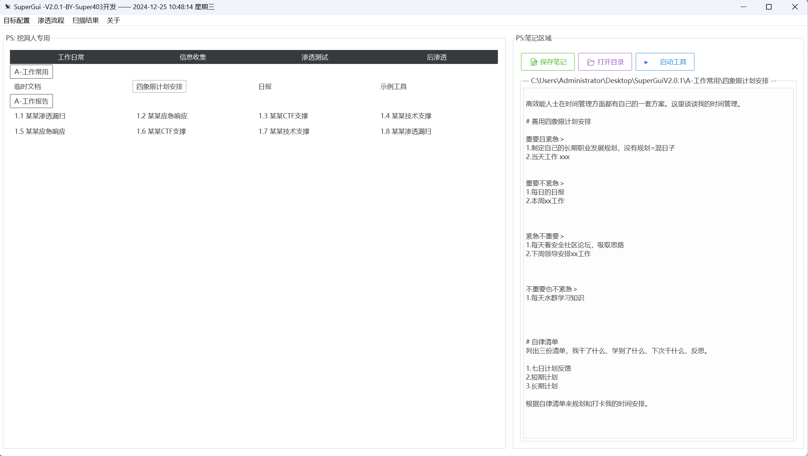
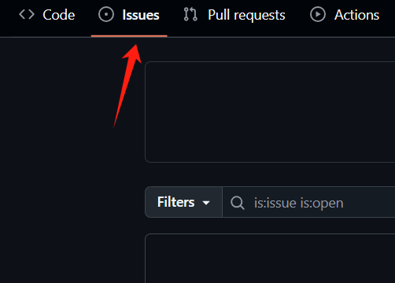
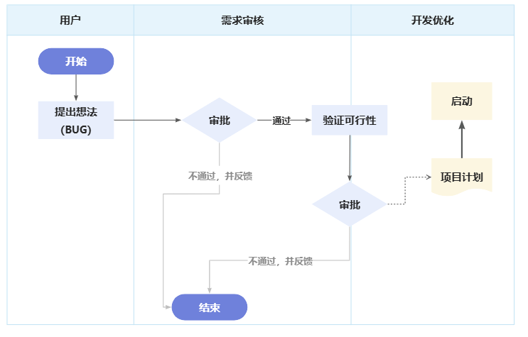

# 一款最适合网安从业者的GUI管理的工具箱

## 前言

**简介：**`SuperGUI`​是一个适用于网络安全从业者的GUI管理的工具箱。

**工具定义**：面向网络安全从业者的辅助管理工具。

**设计结构**：采用现代设计理念，通过`tkinter`结合`ttkbootstrap`主题构建，实现了灵活的主题配置和样式自定义功能。不仅提供了美观的界面，还增强了功能的强大性，从而显著提升了用户体验和界面的美观度。

**开发初衷**：开发本工具主要为了方便个人安服工作，早在22年一直在使用绿盟大佬`Github`的`FreeGui`​项目，后来觉得有部分功能可以改进，一点一点优化代码逻辑，美化界面，最后干脆二开重构项目代码，保留工具核心逻辑魔改后，于是就有了本项目`SuperGUI` 。

**PS**：（有需求、建议、BUG提交，参考下述介绍，明年工作项目比较多，会抽空优化。）

## 工具界面

​

## 功能介绍

**左侧工具区域**：精心设计的工具列表，按分类展示，便于用户快速定位所需工具。

**右侧笔记区**：为每个工具配备的笔记空间，支持直观的笔记的记录、查看和编辑。

**顶部菜单栏**：集成了目标配置、渗透流程、扫描结果等功能，操作便捷。

**管理渗透测试工具**：用户可以轻松地按类别管理和组织渗透测试工具。通过双击工具目录，用户能够快速启动所需工具，并自定义工具的启动命令。此外，系统支持为每个工具保存使用笔记，这些笔记将自动保存，方便用户随时查看和编辑。

**个性化主题样式配置**：我们提供主题样式配置功能，以满足用户的个性化需求。用户可以针对域名、IP、URL等测试目标进行配置，并自定义工具启动命令，实现半自动化的渗透测试流程。

**时间和日志记录**：系统实时显示当前时间，并支持工具的快速启动。自动记录日志功能和内置的错误处理及异常提示机制，确保工具的稳定性和可靠性。

**模块化代码设计**：代码采用模块化设计，包含了完善的错误处理和日志记录功能，以提高代码的可维护性和扩展性。

## 开发设计思路

为了方便各位师傅使用，简单的讲一下工具开发流程，方便需要二开的师傅们，同时有需求建议可以提交。

当前版本`2.0.1` 后续代码会更新迭代中发生改变，这个是我一直在长期使用的工具，所以不用担心废弃无更新。

### 文件结构

```python
SuperGUI/
├── app.py              # 主程序入口
├── start.vbs           # 启动脚本
├── requirements.txt    # 依赖配置
├── config/            # 配置目录
│   ├── config.ini     # 主配置文件
│   ├── command.ini    # 命令配置文件
│   ├── favicon.ico    # 程序图标
│   └── web.png        # 界面资源
├── output/            # 输出目录
└── target/            # 目标文件目录
```


## 版本历史

* V2.0.1 (2024.12.23)
  
  * 更新界面设计，美化界面主题，图标。
  * 添加渗透流程图，来源摘取 `kkbo8005/mitan`工具。
  * 设置日志记录功能。
  * 优化启动脚本。
  * 增强错误处理。

## 需求（BUG）提交

打开Github点击这里提交需求问题。

​

作者收到后参考下面流程完善项目

​
