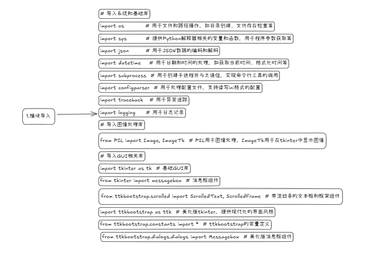
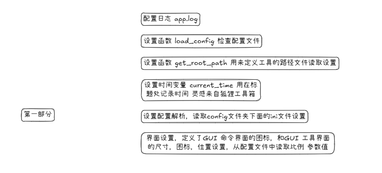
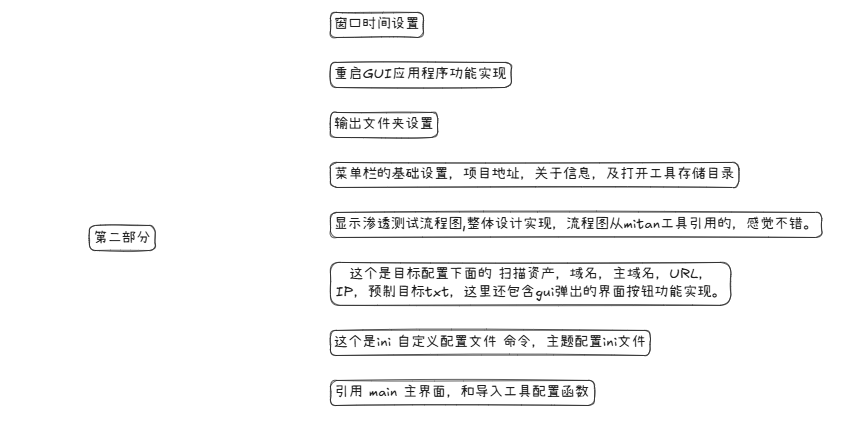
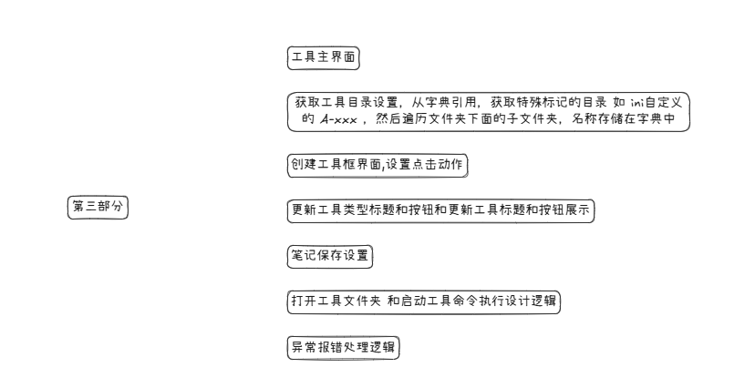

# 一款最适合网安从业者的GUI管理的工具箱

## 前言

**简介：**`SuperGUI`​是一个适用于网络安全从业者的GUI管理的工具箱。

**工具定义**：面向网络安全从业者的辅助管理工具。

**设计结构**：采用现代设计理念，通过`tkinter`结合`ttkbootstrap`主题构建，实现了灵活的主题配置和样式自定义功能。不仅提供了美观的界面，还增强了功能的强大性，从而显著提升了用户体验和界面的美观度。

**开发初衷**：开发本工具主要为了方便个人安服工作，早在22年一直在使用绿盟大佬`Github`的`FreeGui`​项目，后来觉得有部分功能可以改进，一点一点优化代码逻辑，美化界面，最后干脆二开重构项目代码，保留工具核心逻辑魔改后，于是就有了本项目`SuperGUI` 。

**PS**：（有需求、建议、BUG提交，参考下述介绍，明年工作项目比较多，会抽空优化。）

## 工具界面

​

## 功能介绍

**左侧工具区域**：精心设计的工具列表，按分类展示，便于用户快速定位所需工具。

**右侧笔记区**：为每个工具配备的笔记空间，支持直观的笔记的记录、查看和编辑。

**顶部菜单栏**：集成了目标配置、渗透流程、扫描结果等功能，操作便捷。

**管理渗透测试工具**：用户可以轻松地按类别管理和组织渗透测试工具。通过双击工具目录，用户能够快速启动所需工具，并自定义工具的启动命令。此外，系统支持为每个工具保存使用笔记，这些笔记将自动保存，方便用户随时查看和编辑。

**个性化主题样式配置**：我们提供主题样式配置功能，以满足用户的个性化需求。用户可以针对域名、IP、URL等测试目标进行配置，并自定义工具启动命令，实现半自动化的渗透测试流程。

**时间和日志记录**：系统实时显示当前时间，并支持工具的快速启动。自动记录日志功能和内置的错误处理及异常提示机制，确保工具的稳定性和可靠性。

**模块化代码设计**：代码采用模块化设计，包含了完善的错误处理和日志记录功能，以提高代码的可维护性和扩展性。

## 开发设计思路

为了方便各位师傅使用，简单的讲一下工具开发流程，方便需要二开的师傅们，同时有需求建议可以提交。

当前版本`2.0.1` 后续代码会更新迭代中发生改变，这个是我一直在长期使用的工具，所以不用担心废弃无更新。

### 文件结构

```python
SuperGUI/
├── app.py              # 主程序入口
├── start.vbs           # 启动脚本
├── requirements.txt    # 依赖配置
├── config/            # 配置目录
│   ├── config.ini     # 主配置文件
│   ├── command.ini    # 命令配置文件
│   ├── favicon.ico    # 程序图标
│   └── web.png        # 界面资源
├── output/            # 输出目录
└── target/            # 目标文件目录
```

### 代码思路

下面简单讲一下代码设计

#### 具体模块

​

```python
# 导入系统和基础库
import os          # 用于文件和路径操作，如目录创建、文件存在检查等
import sys         # 提供Python解释器相关的变量和函数，用于程序参数获取等
import json        # 用于JSON数据的编码和解码
import datetime    # 用于日期和时间的处理，如获取当前时间、格式化时间等
import subprocess  # 用于创建子进程并与之通信，实现命令行工具的调用
import configparser  # 用于处理配置文件，支持读写ini格式的配置
import traceback   # 用于异常追踪
import logging     # 用于日志记录

# 导入图像处理库
from PIL import Image, ImageTk  # PIL用于图像处理，ImageTk用于在tkinter中显示图像

# 导入GUI相关库
import tkinter as tk  # 基础GUI库
from tkinter import messagebox  # 消息框组件
import ttkbootstrap as ttk  # 美化版tkinter，提供现代化的界面风格
from ttkbootstrap.constants import *  # ttkbootstrap的常量定义
from ttkbootstrap.scrolled import ScrolledText, ScrolledFrame  # 带滚动条的文本框和框架组件
from ttkbootstrap.dialogs.dialogs import Messagebox  # 美化版消息框组件
```

#### 第一部分

​

1.首先是配置日志，记录代码启动关闭时间。

```python
# 配置日志
logging.basicConfig(
    filename='app.log',
    level=logging.INFO,
    format='%(asctime)s - %(levelname)s - %(message)s'
)

# 运行结果在 app.log 文件中 
2024-12-23 17:59:27,720 - INFO - 启动应用程序...
2024-12-23 18:00:19,681 - INFO - 正在重启应用程序...
2024-12-23 18:00:19,987 - INFO - 启动应用程序...
2024-12-23 18:01:03,049 - INFO - 应用程序关闭
2024-12-23 18:01:18,475 - INFO - 启动应用程序...
```

2.设置函数 load_config 检查配置文件

```python
def load_config(config_path, encoding='utf-8'):
    """安全加载配置文件"""
    try:
        if not os.path.exists(config_path):
            logging.error(f"配置文件不存在: {config_path}")
            messagebox.showerror("错误", f"配置文件不存在: {config_path}")
            return None

        config = configparser.ConfigParser()
        config.read(filenames=config_path, encoding=encoding)
        return config
    except Exception as e:
        logging.error(f"加载配置文件失败: {config_path}, 错误: {str(e)}")
        messagebox.showerror("错误", f"加载配置文件失败: {str(e)}")
        return None
```

3.设置函数 get_root_path 用来定义工具的路径文件读取设置

```python
def get_root_path():
    """安全获取根目录路径"""
    try:
        # 获取当前脚本所在的目录路径
        current_dir = os.path.dirname(os.path.abspath(__file__))
        # 获取项目根目录（当前脚本的上级目录）
        root_path = os.path.dirname(current_dir)
        return current_dir, root_path
    except Exception as e:
        logging.error(f"获取根目录路径失败: {str(e)}")
        messagebox.showerror("错误", f"获取根目录路径失败: {str(e)}")
        return None, None

# 初始化路径相关变量
directory, rootPath = get_root_path()
if directory is None or rootPath is None:
    sys.exit(1)

output_path = os.path.join(directory, 'Output')
style_config_path = os.path.join(directory, "config", "config.ini")
command_config_path = os.path.join(directory, "config", "command.ini")
```

4.设置时间变量 current_time 用在标题处记录时间 灵感来自狐狸工具箱

```python
# 初始化时间相关变量
now = datetime.datetime.now()
time = now.strftime('%H:%M:%S')
current_time = now.strftime('%Y-%m-%d %H:%M:%S %A')

print(f" [+] {time} 调试信息: 格式化时间{current_time}")
```

5.设置配置解析，读取config文件夹下面的ini文件设置

```python
# 初始化配置解析器
config_style = load_config(style_config_path)
if config_style is None:
    sys.exit(1)

conf = load_config(command_config_path)
if conf is None:
    sys.exit(1)

try:
    # 从配置文件获取工具列表
    toolFunlist = config_style.get("tool", "funList")
    toolFunlist = json.loads(toolFunlist)
except Exception as e:
    logging.error(f"解析工具列表失败: {str(e)}")
    messagebox.showerror("错误", f"解析工具列表失败: {str(e)}")
    sys.exit(1)
```

6.这里是界面设置，定义了GUI 命令界面的图标，和GUI 工具界面的尺寸，图标，位置设置，从配置文件中读取比例 参数值

```python
print("""

  █████████                                              █████     ███    ██   ██████
 ███░░░░░███                                          ███░░░░░███░░███  ░░███ ░░███ 
░███    ░░░  █████ ████ ████████   ██████  ████████  ███     ░░░  ░███   ░███  ░███ 
░░█████████ ░░███ ░███ ░░███░░███ ███░░███░░███░░███░███          ░███   ░███  ░███ 
 ░░░░░░░░███ ░███ ░███  ░███ ░███░███████  ░███ ░░░ ░███    █████ ░███   ░███  ░███ 
 ███    ░███ ░███ ░███  ░███ ░███░███░░░   ░███     ░░███  ░░███  ░███   ░███  ░███ 
░░█████████  ░░████████ ░███████ ░░██████  █████     ░░█████████  ░░████████   █████   V 2.0.1
 ░░░░░░░░░    ░░░░░░░░  ░███░░░   ░░░░░░  ░░░░░       ░░░░░░░░░    ░░░░░░░░   ░░░░░    BY:Super403
                        ░███                                                    
                        █████                                                   
                       ░░░░░ 
""")

# 初始化主窗口
root = ttk.Window(title = config_style["app"]["title"] + " —— " + current_time, themename = str(config_style["app"]["theme"]))  # 创建主窗口，设置标题和主题
root.iconbitmap('./config/favicon.ico')     # 设置窗口图标

# 获取屏幕尺寸
screenheight = root.winfo_screenheight()    # 获取屏幕高度
screenwidth = root.winfo_screenwidth()      # 获取屏幕宽度

# 从配置文件读取窗口尺寸
size_w = config_style["app"]["size_w"]      # 窗口宽度
size_h = config_style["app"]["size_h"]      # 窗口高度

# 计算窗口位置，使其居中显示
center_w = int((screenwidth - int(size_w)) / 2)             # 计算水平居中位置
center_h = int((screenheight - int(size_h)) / 2)            # 计算垂直居中位置
root.geometry(f'{size_w}x{size_h}+{center_w}+{center_h}')   # 设置窗口大小和位置

# 设置GUI布局相关参数
app_size_w = int(config_style["app"]["size_w"])     # GUI窗口宽度
app_size_h = int(config_style["app"]["size_h"])     # GUI窗口高度
average = int(config_style["app"]["average"])       # GUI框架划分比例
tool_aver = int(config_style["app"]["tool_aver"])   # 工具区域占比
note_aver = int(config_style["app"]["note_aver"])   # 笔记区域占比

# 输出窗口尺寸和位置信息
print(f" [+] {time} 调试信息: 电脑屏幕的尺寸分别是，宽{screenwidth} + 高{screenheight}")
print(f" [+] {time} 调试信息: 位置参数信息：宽{size_w} ,高{size_h},左边距{center_w},上边距{center_h},")
print(f" [+] {time} 调试信息: 工具框架的宽是:{int(app_size_w/average*tool_aver)}")
print(f" [+] {time} 调试信息: 笔记框架的宽是:{int(app_size_w/average*note_aver)}")
```

#### 第二部分

​

在APP类里面设置菜单栏目功能，及相关实现

1.窗口时间设置

```python
    def update_time(self):
        """
        更新窗口标题栏的时间显示

        每秒更新一次窗口标题，显示当前的日期、时间和星期
        使用after方法实现定时更新
        """
        now = datetime.datetime.now()
        current_time = now.strftime('%Y-%m-%d %H:%M:%S %A')
        self.master.title(config_style["app"]["title"] + " —— " + current_time)
        self.master.after(1000, self.update_time)   # 每秒更新一次
```

2.重启GUI应用程序功能实现

```python
    def gui_tools(self):
        """
        重启GUI应用程序
        """
        try:
            python = sys.executable
            logging.info("正在重启应用程序...")
            os.execl(python, python, *sys.argv)
        except Exception as e:
            logging.error(f"重启应用程序失败: {str(e)}")
            messagebox.showerror("错误", f"重启应用程序失败: {str(e)}")
```

3.输出文件夹设置

```python
    def open_output_folder(self):
        """
        打开扫描结果输出文件夹：如果文件夹不存在则创建，使用系统默认程序打开该文件夹
        """
        os.makedirs(output_path, exist_ok=True)  # 确保输出目录存在
        os.startfile(output_path)
```

4.菜单栏的基础设置，项目地址，关于信息，及打开工具存储目录

```python
    def show_Project(self):
        """
        显示项目地址信息：在消息框中显示项目的GitHub仓库地址
        """
        messagebox.showinfo(title= "项目地址", message="http://github.com/super403")

    def show_about(self):
        """
        显示关于信息：在消息框中显示作者信息和当前版本号
        """
        messagebox.showinfo(title="关于", message="作者: super403  当前版本: 2.0")

    def show_GJX(self):
        """
        打开工具存储目录 使用系统默认文件管理器打开存储工具的根目录
        """
        os.system(f"start {rootPath}")
```

5.显示渗透测试流程图,整体设计实现，流程图从mitan工具引用的，感觉不错。

```python
    def show_process_image(self):
        """
        显示渗透测试流程图

        创建新窗口显示渗透测试标准流程图
        包含以下功能：
        1. 图片自适应缩放
        2. 滚动条支持
        3. 鼠标滚轮支持
        4. 关闭按钮
        """
        top = tk.Toplevel()
        top.title("标准渗透规范")   # 创建顶层窗口标题
        try:
            # 加载和处理图片
            img = Image.open('./config/web.png')            # 打开流程图
            desired_width = 800                             # 设置期望宽度
            width, height = img.size                        # 获取原始尺寸
            ratio = height / width                          # 计算宽高比
            desired_height = int(desired_width * ratio)     # 按比例计算高度

            # 调整图片大小
            img = img.resize((desired_width, desired_height), Image.Resampling.LANCZOS)
            photo = ImageTk.PhotoImage(img)

            # 创建滚动框架
            scroll_frame = ttk.Frame(top)
            scroll_frame.pack(fill=BOTH, expand=True, padx=10, pady=10)

            # 创建Canvas和滚动条
            canvas = tk.Canvas(scroll_frame, bd=0, highlightthickness=0)
            scrollbar_y = ttk.Scrollbar(scroll_frame, orient=VERTICAL, command=canvas.yview)
            scrollbar_x = ttk.Scrollbar(scroll_frame, orient=HORIZONTAL, command=canvas.xview)

            # 配置Canvas
            canvas.configure(xscrollcommand=scrollbar_x.set, yscrollcommand=scrollbar_y.set)

            # 布局滚动条
            scrollbar_y.pack(side=RIGHT, fill=Y)
            scrollbar_x.pack(side=BOTTOM, fill=X)
            canvas.pack(side=LEFT, fill=BOTH, expand=True)

            # 创建内部框架
            inner_frame = ttk.Frame(canvas)
            canvas.create_window((0, 0), window=inner_frame, anchor=NW)

            # 显示图片
            label = ttk.Label(inner_frame, image=photo)
            label.image = photo  # 保持引用防止被垃圾回收
            label.pack(padx=5, pady=5)

            # 更新内部框架尺寸
            inner_frame.update_idletasks()
            canvas.configure(scrollregion=canvas.bbox("all"))

            # 设置窗口大小和位置
            window_width = desired_width + 40  # 添加边距
            window_height = min(desired_height + 80, 900)  # 限制最大高度

            # 计算居中位置
            screen_width = top.winfo_screenwidth()
            screen_height = top.winfo_screenheight()
            x = (screen_width - window_width) // 2
            y = (screen_height - window_height) // 2
            top.geometry(f"{window_width}x{window_height}+{x}+{y}")

            # 添加鼠标滚轮支持
            def _on_mousewheel(event):
                canvas.yview_scroll(int(-1*(event.delta/120)), "units")
            canvas.bind_all("<MouseWheel>", _on_mousewheel)

            # 添加关闭按钮
            close_button = ttk.Button(top, text="关闭", command=top.destroy)
            close_button.pack(pady=5)

        except Exception as e:
            messagebox.showerror("错误", f"无法加载图片：{str(e)}")
            top.destroy()
```

6.这个是目标配置下面的 扫描资产，域名，主域名，URL，IP，预制目标txt，这里还包含gui弹出的界面按钮功能实现。

```python
    def open_domain(self):
        """打开域名配置文件 调用通用文件打开方法打开domain.txt配置文件"""
        self.open_target_file('domain.txt')

    def open_subdomain(self):
        """打开子域名配置文件 调用通用文件打开方法打开subdomain.txt配置文件"""
        self.open_target_file('subdomain.txt')

    def open_ip(self):
        """打开IP配置文件 调用通用文件打开方法打开ip.txt配置文件"""
        self.open_target_file('ip.txt')

    def open_url_file(self):
        """打开URL配置文件 调用通用文件打开方法打开url.txt配置文件"""
        self.open_target_file('url.txt')

    def open_target_file(self, file_name):
        """打开目标配置文件的通用方法

        Args:
            file_name (str): 要打开的配置文件名

        功能：
        1. 创建配置文件编辑窗口
        2. 提供文件内容的查看和编辑功能
        3. 支持保存、去重、排序等操作
        4. 自动创建不存在的文件
        """
        try:
            # 创建顶层窗口
            top = tk.Toplevel()
            top.title(f"目标配置 - {file_name}")

            # 设置窗口大小和位置
            window_width = 800
            window_height = 600
            screen_width = top.winfo_screenwidth()
            screen_height = top.winfo_screenheight()
            x = (screen_width - window_width) // 2  # 计算窗口x坐标
            y = (screen_height - window_height) // 2  # 计算窗口y坐标
            top.geometry(f"{window_width}x{window_height}+{x}+{y}")  # 设置窗口的几何属性

            # 创建按钮框架
            button_frame = ttk.Frame(top)
            button_frame.pack(fill=X, padx=10, pady=5)      # 填充X方向，设置内边距

            # 创建文本框和滚动条
            text_widget = ScrolledText(top, width=90, height=30)  
            text_widget.pack(padx=10, pady=5, fill=BOTH, expand=True)    # 设置填充、内边距、扩展

            # 尝试读取文件内容
            file_path = os.path.join('target', file_name)           # 拼接文件路径
            if os.path.exists(file_path):                           # 检查文件是否存在
                with open(file_path, 'r', encoding='utf-8') as f:   # 以读取模式打开文件
                    content = f.read()                              # 读取文件内容
                text_widget.insert('1.0', content)                  # 将内容插入文本框
            else:
                text_widget.insert('1.0', f'文件 {file_name} 不存在，将在保存时创建。')  # 文件不存在时提示

            def save_content():
                """保存文件内容的内部函数"""
                content = text_widget.get('1.0', tk.END)                    # 获取文本框内容
                os.makedirs('target', exist_ok=True)                        # 确保target目录存在
                with open(file_path, 'w', encoding='utf-8') as f:           # 以写入模式打开文件
                    f.write(content)                                        # 写入内容
                messagebox.showinfo("成功", f"{file_name} 保存成功！")      # 显示保存成功消息

            def remove_duplicates():
                """去除重复行的内部函数"""
                content = text_widget.get('1.0', tk.END).strip().split('\n')                # 获取所有内容并按行分割
                unique_lines = list(set(line.strip() for line in content if line.strip()))  # 使用集合去重，同时过滤掉空行
                text_widget.delete('1.0', tk.END)                                           # 清空文本框
                text_widget.insert('1.0', '\n'.join(unique_lines))                          # 将去重后的内容写回文本框
                save_content()                                                              # 自动保存
                messagebox.showinfo("成功", "已完成去重并保存！")                             # 显示去重成功消息

            def sort_content():
                """对内容进行排序的内部函数"""
                content = text_widget.get('1.0', tk.END).strip().split('\n')                # 获取所有内容并按行分割
                sorted_lines = sorted(line.strip() for line in content if line.strip())     # 过滤空行并排序
                text_widget.delete('1.0', tk.END)                                           # 清空文本框
                text_widget.insert('1.0', '\n'.join(sorted_lines))                          # 将排序后的内容写回文本框
                save_content()                                                              # 自动保存
                messagebox.showinfo("成功", "已完成排序并保存！")                           # 显示排序成功消息

            def open_folder():
                """打开文件所在目录的内部函数"""
                folder_path = os.path.abspath('target')                                     # 获取target目录的绝对路径
                os.makedirs(folder_path, exist_ok=True)                                     # 确保目录存在
                os.startfile(folder_path)                                                   # 打开目录

            # 创建功能按钮
            save_button = ttk.Button( 
                button_frame,
                text="💾 保存",
                command=save_content,
                bootstyle="success-outline"
            )
            save_button.pack(side=LEFT, padx=5) 

            remove_dup_button = ttk.Button(  
                button_frame,
                text="🔄 去重",
                command=remove_duplicates,
                bootstyle="info-outline"
            )
            remove_dup_button.pack(side=LEFT, padx=5)  

            sort_button = ttk.Button(  
                button_frame,
                text="📊 排序",
                command=sort_content,
                bootstyle="warning-outline"
            )
            sort_button.pack(side=LEFT, padx=5) 

            folder_button = ttk.Button( 
                button_frame,
                text="📂 打开目录",
                command=open_folder,
                bootstyle="primary-outline"
            )
            folder_button.pack(side=LEFT, padx=5)  

        except Exception as e:  # 捕获异常
            messagebox.showerror("错误", f"无法打开文件：{str(e)}") 
```

7.这个是ini 自定义配置文件 命令，主题配置ini文件

```python
    def open_weapon_config(self):
        """打开武器化配置文件"""
        try:
            if os.path.exists(command_config_path): 
                # 创建顶层窗口
                top = tk.Toplevel()
                top.title("武器化设置")

                # 设置窗口大小和位置
                window_width = 800
                window_height = 600
                screen_width = top.winfo_screenwidth()
                screen_height = top.winfo_screenheight()
                x = (screen_width - window_width) // 2
                y = (screen_height - window_height) // 2
                top.geometry(f"{window_width}x{window_height}+{x}+{y}")

                # 创建按钮框架
                button_frame = ttk.Frame(top)
                button_frame.pack(fill=X, padx=10, pady=5)

                # 创建文本框和滚动条
                text_widget = ScrolledText(top, width=90, height=30)
                text_widget.pack(padx=10, pady=5, fill=BOTH, expand=True)

                # 读取文件内容
                with open(command_config_path, 'r', encoding='utf-8') as f: 
                    content = f.read()
                text_widget.insert('1.0', content)

                def save_content():
                    """保存配置文件内容"""
                    content = text_widget.get('1.0', tk.END)
                    with open(command_config_path, 'w', encoding='utf-8') as f: 
                        f.write(content)
                    messagebox.showinfo("成功", "武器化配置保存成功！")

                # 创建保存按钮
                save_button = ttk.Button(
                    button_frame,
                    text="💾 保存",
                    command=save_content,
                    bootstyle="success-outline"
                )
                save_button.pack(side=LEFT, padx=5)

            else:
                messagebox.showerror("错误", "武器化配置文件不存在！")
        except Exception as e:
            messagebox.showerror("错误", f"无法打开武器化配置文件：{str(e)}")

    def open_theme_config(self):
        """打开主题配置文件"""
        try:
            if os.path.exists(style_config_path):  # 使用正确的主题配置文件路径
                # 创建顶层窗口
                top = tk.Toplevel()
                top.title("主题配置")

                # 设置窗口大小和位置
                window_width = 800
                window_height = 600
                screen_width = top.winfo_screenwidth()
                screen_height = top.winfo_screenheight()
                x = (screen_width - window_width) // 2
                y = (screen_height - window_height) // 2
                top.geometry(f"{window_width}x{window_height}+{x}+{y}")

                # 创建按钮框架
                button_frame = ttk.Frame(top)
                button_frame.pack(fill=X, padx=10, pady=5)

                # 创建文本框和滚动条
                text_widget = ScrolledText(top, width=90, height=30)
                text_widget.pack(padx=10, pady=5, fill=BOTH, expand=True)

                # 读取文件内容
                with open(style_config_path, 'r', encoding='utf-8') as f:  # 使用正确的主题配置文件路径
                    content = f.read()
                text_widget.insert('1.0', content)

                def save_content():
                    """保存主题配置内容"""
                    content = text_widget.get('1.0', tk.END)
                    with open(style_config_path, 'w', encoding='utf-8') as f:  # 使用正确的主题配置文件路径
                        f.write(content)
                    messagebox.showinfo("成功", "主题配置保存成功！\n重启程序后生效")

                # 创建保存按钮
                save_button = ttk.Button(
                    button_frame,
                    text="💾 保存",
                    command=save_content,
                    bootstyle="success-outline"
                )
                save_button.pack(side=LEFT, padx=5)

                # 创建重启按钮
                restart_button = ttk.Button(
                    button_frame,
                    text="🔄 重启应用",
                    command=self.gui_tools,
                    bootstyle="warning-outline"
                )
                restart_button.pack(side=LEFT, padx=5)

            else:
                messagebox.showerror("错误", "主题配置文件不存在！")
        except Exception as e:
            messagebox.showerror("错误", f"无法打开主题配置文件：{str(e)}")
```

8.引用 main 主界面，和导入工具配置函数

```python
    def __init__(self, master=None):
        super().__init__(master)
        self.master = master
        self.pack()
        self.update_time()  # 初始化时间更新
        self.toolsDic = self.toolsDir()  # 设置工具目录，使用内部的toolsDir方法
        self.main()  # 创建界面组件
```

#### 第三部分

​

1.工具主界面

```python
    def main(self):
        """
        创建并初始化主界面组件
        """
        # 菜单区域
        self.menu_bar = tk.Menu(root)
        root.config(menu=self.menu_bar)

        # 添加目标配置菜单
        self.target_menu = tk.Menu(self.menu_bar)
        self.target_menu.add_command(label="域名", command=self.open_domain)
        self.target_menu.add_command(label="子域名", command=self.open_subdomain)
        self.target_menu.add_command(label="IP", command=self.open_ip)
        self.target_menu.add_command(label="网站", command=self.open_url_file)
        self.target_menu.add_separator()  # 添加分隔线
        self.target_menu.add_command(label="工具存储路径", command=self.show_GJX)
        self.target_menu.add_command(label="武器化设置", command=self.open_weapon_config)
        self.target_menu.add_command(label="刷新GUI", command=self.gui_tools)
        self.menu_bar.add_cascade(label="目标配置", menu=self.target_menu)

        # 添加渗透流程菜单
        self.process_menu = tk.Menu(self.menu_bar)
        self.process_menu.add_command(label="查看流程图", command=self.show_process_image)
        self.menu_bar.add_cascade(label="渗透流程", menu=self.process_menu)

        # 添加扫描结果菜单
        self.output_menu = tk.Menu(self.menu_bar)
        self.output_menu.add_command(label="打开结果文件夹", command=self.open_output_folder)
        self.menu_bar.add_cascade(label="扫描结果", menu=self.output_menu)

        # 菜单 项目地址选项
        self.about_menu = tk.Menu(self.menu_bar)
        self.about_menu.add_command(label="作者", command=self.show_about)
        self.about_menu.add_command(label="项目地址", command=self.show_Project)
        self.about_menu.add_command(label="主题配置", command=self.open_theme_config)
        self.menu_bar.add_cascade(label="关于", menu=self.about_menu)

        # 设置总体框架
        self.toolFra = ttk.LabelFrame(self, text = config_style["tool"]["title"], bootstyle = config_style["tool"]["theme"], width = int(app_size_w / average * tool_aver), height = app_size_h, labelanchor = NW, padding = 7, border = 10)
        self.toolFra.pack(side = "left", fill = BOTH, ipadx = 7, ipady = 10, padx = 10, pady = 20)

        # 设置滑块文本框架
        self.toolFrame = ScrolledFrame(self.toolFra, autohide = True, width = int(app_size_w / average * tool_aver), height = app_size_h + 500, bootstyle = config_style["tool"]["scrolled"])
        self.toolFrame.pack(fill = BOTH, anchor = NW)

        # 设置笔记框架
        self.noteFrame = ttk.LabelFrame(self, text = config_style["note"]["title"], bootstyle = config_style["note"]["theme"], width = int(app_size_w / average * note_aver), height = app_size_h, labelanchor = NW, padding = 7, border = 10)
        self.noteFrame.pack(side = "left", ipadx = 7, ipady = 10, padx = 10, pady = 20)

        # 设置笔记框架上面框架用于放置按钮区域
        self.noteFrame_up = ttk.Frame(self.noteFrame, bootstyle = config_style["note"]["theme_up"])
        self.noteFrame_up.pack(side = "top", fill = "x", ipadx = 7, ipady = 10)

        # 设置按钮 保存笔记  # 使用Unicode图标 # 使用成功色调 
        self.noteFrameTxtSaveBtn = ttk.Button(self.noteFrame_up, text = "📝 保存笔记", bootstyle = "success-outline", cursor = "hand2")
        self.noteFrameTxtSaveBtn.pack(anchor = W, padx = 5, pady = 2, ipadx = 10, side = "left", ipady = 5)

        # 设置按钮 打开目录 # 使用信息色调
        self.noteFrameStartBtn = ttk.Button(self.noteFrame_up, text = "📂 打开目录", bootstyle = "info-outline", cursor = "hand2")
        self.noteFrameStartBtn.pack(anchor = W, side = "left", padx = 5, pady = 2, ipadx = 10, ipady = 5)

        # 设置按钮 启动工具 # 使用主要色调
        self.noteFrameOpenDirBtn = ttk.Button(self.noteFrame_up, text = "▶️ 启动工具", bootstyle = "primary-outline", cursor = "hand2")
        self.noteFrameOpenDirBtn.pack(anchor = W, side = "left", padx = 5, pady = 2, ipadx = 10, ipady = 5)

        # 设置文本框用于记事本区域
        self.noteFrame_down = ttk.LabelFrame(self.noteFrame, text = config_style["note"]["txt_title"], style = config_style["note"]["noteFrameDownStyle"], padding = 5)
        self.noteFrame_down.pack(fill = BOTH, padx = 3, pady = 3)

        # 滑块文本框
        self.txtCount = ScrolledText(self.noteFrame_down, width = int(app_size_w / average * note_aver), height = app_size_h, bootstyle = config_style["note"]["scrolledTextBootstyle"], autohide = True)
        self.txtCount.pack(fill = BOTH, side = BOTTOM, anchor = NW)
        self.toolFrameFun()
```

2.获取工具目录设置，从字典引用，获取特殊标记的目录 如 ini自定义的 A-xxx ，然后遍历文件夹下面的子文件夹，名称存储在字典中

```python
    def toolsDir(self, type_mark=toolFunlist[0][1]):
        """
        获取工具目录信息
        """
        tools_dict = {}  # 初始化工具字典
        tool_type_root_dir = rootPath   # 工具类型根目录

        # 获取所有包含特定标记的目录
        tool_type_dir = sorted([
            i  
            for i in os.listdir(tool_type_root_dir)  
            if os.path.isdir(os.path.join(tool_type_root_dir, i))  
            and i.count(type_mark) == 1  
        ])

        # 遍历工具类型目录
        for toolType in tool_type_dir:
            # 获取每个类型下的工具列表
            tools = sorted([
                i  
                for i in os.listdir(os.path.join(tool_type_root_dir, toolType))  
                if os.path.isdir(os.path.join(tool_type_root_dir, toolType, i)) 
            ])
            tools_dict[toolType] = tools  

        return tools_dict 
```

2.创建工具框界面,设置点击动作

```python
def toolFrameFun(self):
        """
        创建工具框架界面
        """
        # 创建工具功能按钮
        for i in range(int(config_style["tool"]["toolColumn"])):
            self.Btnfr1 = ttk.Button(
                self.toolFrame, 
                text=toolFunlist[i][0],  
                width=config_style["tool"]["columnWidth"], 
                bootstyle=config_style["tool"]["funBtnBootstyle"],  
                command=lambda arg=toolFunlist[i][1]: self.toolFunBtn(arg)
            ).grid(pady=2, row=0, column=i)  

        r = 1  
        # 创建工具类型按钮
        for k in self.toolsDic.keys():
            self.btnToolType = ttk.Button(
                self.toolFrame,
                text=k,
                bootstyle=config_style["tool"]["typeBtnBootstyle"],
                command=lambda a=k: [self.openToolTypeNote(a), self.toolTypeTitle(a)]
            )
            self.btnToolType.grid(row=r, column=0, columnspan=int(config_style["tool"]["toolColumn"]), sticky=W)

            # 绑定双击事件
            self.btnToolType.bind("<Double-Button-1>", lambda event, arg0=k: self.openTypeDir(arg0))

            r += 1
            c = 0  

            # 创建具体工具按钮
            for i in self.toolsDic[k]:
                if c == int(config_style["tool"]["toolColumn"]):
                    r += 1  
                    c = 0
                self.btnTools = ttk.Button(
                    self.toolFrame,
                    bootstyle=config_style["tool"]["toolBtnBootstyle"],
                    text=i,
                    command=lambda a=k, b=i: [self.openToolNote(a, b), self.toolTitle(a, b)]
                )
                self.btnTools.grid(row=r, column=c, sticky=N+S+W, pady=2)

                # 绑定双击和右键事件
                self.btnTools.bind("<Double-Button-1>", lambda event, arg1=k, arg2=i: self.openToolDir(arg1, arg2))
                self.btnTools.bind("<ButtonPress-3>", lambda event, arg1=k, arg2=i: self.openToolCmd(arg1, arg2))

                c += 1
            r += 1
```

3.更新工具类型标题和按钮和更新工具标题和按钮展示

```python
    def toolTypeTitle(self, typedir):
        """
        更新工具类型标题和按钮
        """
        # 清除现有按钮
        for widget in self.noteFrame_up.winfo_children():
            widget.destroy()

        # 创建新按钮
        self.noteFrameTxtSaveBtn = ttk.Button(
            self.noteFrame_up,
            text="📝 保存笔记",
            bootstyle="success-outline",
            cursor="hand2",
            command=lambda a=typedir: self.saveTypeNote(a)
        )
        self.noteFrameTxtSaveBtn.pack(anchor=W, side="left", padx=5, pady=2, ipadx=10, ipady=5)

        self.noteFrameStartBtn = ttk.Button(
            self.noteFrame_up,
            text="📂 打开目录",
            bootstyle="info-outline",
            cursor="hand2",
            command=lambda arg0=typedir: self.openTypeDir(arg0)
        )
        self.noteFrameStartBtn.pack(anchor=W, side="left", padx=5, pady=2, ipadx=10, ipady=5)


    def toolTitle(self, typedir, tool):
        """
        更新工具标题和按钮
        """
        # 清除现有按钮
        for widget in self.noteFrame_up.winfo_children():
            widget.destroy()

        # 创建新按钮
        self.noteFrameTxtSaveBtn = ttk.Button(
            self.noteFrame_up,
            text="📝 保存笔记",
            bootstyle="success-outline",
            cursor="hand2",
            command=lambda a=typedir, b=tool: self.saveToolNote(a, b)
        )
        self.noteFrameTxtSaveBtn.pack(anchor=W, side="left", padx=5, pady=2, ipadx=10, ipady=5)

        self.noteFrameStartBtn = ttk.Button(
            self.noteFrame_up,
            text="📂 打开目录",
            bootstyle="info-outline",
            cursor="hand2",
            command=lambda arg1=typedir, arg2=tool: self.openToolDir(arg1, arg2)
        )
        self.noteFrameStartBtn.pack(anchor=W, side="left", padx=5, pady=2, ipadx=10, ipady=5)

        self.noteFrameOpenDirBtn = ttk.Button(
            self.noteFrame_up,
            text="▶️ 启动工具",
            bootstyle="primary-outline",
            cursor="hand2",
            command=lambda arg1=typedir, arg2=tool: self.openToolCmd(arg1, arg2)
        )
        self.noteFrameOpenDirBtn.pack(anchor=W, side="left", padx=5, pady=2, ipadx=10, ipady=5)
```

4.笔记保存设置

```python
    def saveTypeNote(self, typedir):
        """
        保存工具类型笔记
        """
        notePath = os.path.join(rootPath, typedir, config_style["app"]["txt_mark"])
        content = self.txtCount.get(1.0, END)
        with open(notePath, "w", encoding='utf-8') as f:
            f.write(content)

    def saveToolNote(self, typedir, tool):
        """
        保存具体工具笔记
        """
        notePath = os.path.join(rootPath, typedir, tool, config_style["app"]["txt_mark"])
        content = self.txtCount.get(1.0, END)
        with open(notePath, "w", encoding='utf-8') as f:
            f.write(content)

    def openToolNote(self, typedir, tool):
        """
        打开具体工具的笔记
        """
        notePath = os.path.join(rootPath, typedir, tool, config_style["app"]["txt_mark"])
        self.noteFrame_down["text"] = f"-- {os.path.join(rootPath, typedir, tool)} --"

        if os.path.exists(notePath):
            with open(notePath, encoding='utf-8') as f:
                self.txtCount.delete('1.0', END)
                self.txtCount.insert(END, f.read())
        else:
            Messagebox.ok(
                message="\n\t你还没有创建笔记，已自动创建初始化信息。\t\n",
                title='OpenNote'
            )
            infoMsg = f"-----你还没有创建笔记-----{datetime.datetime.now().strftime('%Y-%m-%d %H:%M:%S')}-----"
            self.txtCount.delete('1.0', END)
            self.txtCount.insert(END, infoMsg)
            with open(notePath, "w", encoding='utf-8') as f:
                f.write(infoMsg)

    def openToolTypeNote(self, typedir):
        """
        打开工具类型的笔记
        """
        notePath = os.path.join(rootPath, typedir, config_style["app"]["txt_mark"])
        self.noteFrame_down["text"] = f"-- {os.path.join(rootPath, typedir)} --"

        if os.path.exists(notePath):
            with open(notePath, encoding='utf-8') as f:
                self.txtCount.delete('1.0', END)
                self.txtCount.insert(END, f.read())
        else:
            Messagebox.ok(
                message="\n\t你还没有创建笔记，已自动创建初始化信息。\t\n",
                title='OpenNote'
            )
            infoMsg = f"-----你还没有创建笔记-----{datetime.datetime.now().strftime('%Y-%m-%d %H:%M:%S')}-----"
            self.txtCount.delete('1.0', END)
            self.txtCount.insert(END, infoMsg)
            with open(notePath, "w", encoding='utf-8') as f:
                f.write(infoMsg)
```

5.打开工具文件夹 和启动工具命令执行设计逻辑

```python
    def openTypeDir(self, typedir):
        """
        打开工具类型目录
        """
        os.startfile(os.path.join(rootPath, typedir))

    def openToolDir(self, typedir, tool):
        """
        打开具体工具目录
        """
        os.startfile(os.path.join(rootPath, typedir, tool))

    def openToolCmd(self, typedir, tool):
        """
        启动具体工具 
        """
        try:
            # 保存当前目录
            original_dir = os.getcwd()
            tool_dir = os.path.join(rootPath, typedir, tool)

            # 检查工具目录是否存在
            if not os.path.exists(tool_dir):
                raise FileNotFoundError(f"工具目录不存在: {tool_dir}")

            # 切换到工具目录
            os.chdir(tool_dir)
            logging.info(f"切换到工具目录: {tool_dir}")

            if tool in conf.sections():
                if "type" in conf.options(tool):
                    shell_type = conf.get(tool, "type")
                    logging.info(f"工具 {tool} 使用 {shell_type} shell")

                    if "command" in conf.options(tool):
                        command = conf.get(tool, "command")
                        logging.info(f"执行命令: {command}")
                        try:
                            subprocess.Popen(
                                f'start powershell -NoExit "{command}"',
                                shell=True,
                                creationflags=subprocess.CREATE_NEW_CONSOLE
                            )
                        except subprocess.SubprocessError as e:
                            raise RuntimeError(f"命令执行失败: {str(e)}")
                    else:
                        subprocess.Popen(
                            f'start powershell -NoExit ',
                            shell=True,
                            creationflags=subprocess.CREATE_NEW_CONSOLE
                        )
                else:
                    command = conf.get(tool, "command")
                    logging.info(f"执行命令: {command}")
                    try:
                        subprocess.Popen(
                            command,
                            shell=True,
                            creationflags=subprocess.CREATE_NEW_CONSOLE
                        )
                    except subprocess.SubprocessError as e:
                        raise RuntimeError(f"命令执行失败: {str(e)}")
            else:
                logging.info(f"使用默认CMD启动工具: {tool}")
                subprocess.Popen(
                    f'start cmd /k "title {tool}"',
                    shell=True,
                    creationflags=subprocess.CREATE_NEW_CONSOLE
                )
        except Exception as e:
            logging.error(f"启动工具失败: {str(e)}\n{traceback.format_exc()}")
            messagebox.showerror("错误", f"启动工具失败: {str(e)}")
        finally:
            # 恢复原始目录
            os.chdir(original_dir)
            logging.info(f"返回原始目录: {original_dir}")

    def toolFunBtn(self, typeMark):
        """
        工具功能按钮点击事件处理 
        """
        self.toolsDic = self.toolsDir(typeMark) 
        for widget in self.toolFrame.winfo_children():
            widget.destroy()
        self.toolFrameFun()
```

6.异常报错处理逻辑

```python
if __name__ == "__main__": 
    try:
        logging.info("启动应用程序...")
        app = APP(master=root)
        root.mainloop()
    except Exception as e:
        logging.error(f"应用程序异常退出: {str(e)}\n{traceback.format_exc()}")
        messagebox.showerror("错误", f"应用程序异常退出: {str(e)}")
        sys.exit(1)
    finally:
        logging.info("应用程序关闭")
```

到此结束

## 参考

FreeGui 项目：核心逻辑

mitan 项目：渗透流程图

## 版本历史

* V2.0.1 (2024.12.23)
  
  * 更新界面设计，美化界面主题，图标。
  * 添加渗透流程图，来源摘取 `kkbo8005/mitan`工具。
  * 设置日志记录功能。
  * 优化启动脚本。
  * 增强错误处理。

## 需求（BUG）提交

打开Github点击这里提交需求问题。

​

作者收到后参考下面流程完善项目

​
