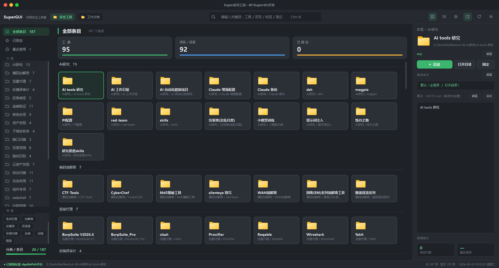
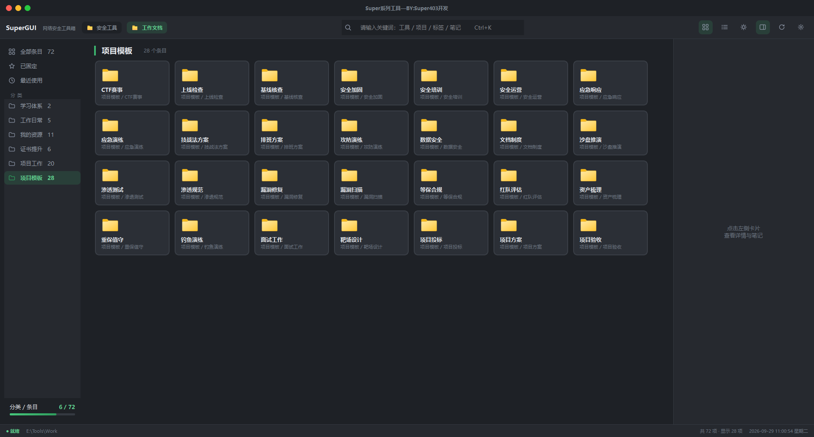

# SuperGUI

> 不搬运工具，也不内置任何安全工具，它就是把你磁盘上已经有的工具整理成一个启动器。整个项目可以丢进 U 盘 / 同步盘 / Git 仓库，到哪都能用。
>
> 把按分类整理好的本地工具目录，变成一个能搜索、能启动、能写笔记的界面。

        

---

## 一、项目概述

面向需要在本机管理大量工具目录的工程师（安全研究、渗透测试、运维等）。这些目录平时直接放在硬盘上，没有统一入口，找起来慢，状态也不好记录。

SuperGUI 相当于在文件系统之上加了一层视图，如下图所示



一级目录作为分类、其中的内容作为条目，不改动原有文件组织方式，提供分类浏览、搜索、启动和 Markdown 笔记。



## 二、功能特性

### 2.1 设计原则

| 原则           | 说明                                                         |
| -------------- | ------------------------------------------------------------ |
| 数据留在磁盘上 | 条目本身不写入数据库，卸载应用或换电脑都不影响原始工具目录   |
| 状态存本地     | 固定、标签、自定义命令等记录存在应用目录内的 SQLite 文件里，整体拷贝即可带走 |
| 开箱即用       | 首次运行自动探测工作区，找不到时再让用户手动指定             |
| 谨慎清理       | 只有确认条目已被删除，才清理对应记录，工作区临时不可用不会误删 |

技术栈：Python + PySide6（Qt 6），目标平台 Windows 11 / 10。

### 2.2 工作区与扫描

| 能力         | 说明                                                         |
| ------------ | ------------------------------------------------------------ |
| 目录即数据源 | 一级子目录是分类，其中文件/目录是条目，扫描结果直接显示到界面上 |
| 分类命名约定 | 支持 `A-`、`A-01-` 前缀（如 `B-01-信息收集`），显示时自动去掉，方便在资源管理器里排序 |
| 条目类型     | 目录里有 `exe / bat / cmd / lnk / ps1` 的算工具，没有的算资料目录，单独的文件算文件条目 |
| 多工作区     | 顶栏预设两个快捷工作区（默认「工具」「桌面」），可改名改路径，切换后立即重扫并重置筛选 |
| 自动重扫     | 监听根目录与分类目录，变更后等 1 秒再重扫（避免连续变动反复触发）；有未保存笔记时跳过 |
| 后台扫描     | 目录遍历和笔记读取都在后台线程（`QThread`）完成，界面不会卡住 |

### 2.3 启动与调度

启动优先级（由高至低）：

1. **自定义命令** — 按配置以 `cmd /k` 或 `powershell -NoExit -Command` 在新控制台中执行
2. **目录里的主程序** — 与目录同名的 `exe` 优先，其次唯一候选；自动排除 `uninstall / unins / 卸载 / setup / update`
3. **系统默认动作** — 打开目录或直接打开文件

底层统一用 `ShellExecuteW` 执行（管理员启动走 `runas`，返回值 ≤ 32 视为失败）。另外还支持这些操作：

| 能力       | 说明                                                         |
| ---------- | ------------------------------------------------------------ |
| 带参数启动 | 弹框输入参数，对自定义命令和主程序都生效；参数会记住，下次自动填上 |
| 管理员启动 | 支持一次性提权与「总是以管理员启动」记忆                     |
| 定位与复制 | 在资源管理器中打开目录或定位文件，一键复制完整路径           |

### 2.4 搜索与筛选

- 搜索范围包括条目名称、完整路径、标签和笔记内容（笔记只索引前 8 KB），输入停顿 150 毫秒后才触发搜索
- 导航维度：全部条目 / 已固定 / 最近使用 / 分类 / 标签，可组合筛选
- 排序规则：常规视图固定项置顶、按名称升序；「最近使用」按最后启动时间降序

### 2.5 笔记

- 文件约定：`NOTE.md` 优先，兼容旧版 `00.txt`
- 详情面板支持 Markdown 预览与纯文本编辑双模式，保存时自动创建笔记文件
- 笔记首行作为卡片摘要（去掉 `#` 等标记后取前 40 字），并同步更新搜索缓存
- 有未保存的改动时，切换条目、重扫、换工作区、退出前都会先询问

### 2.6 系统集成

| 能力         | 说明                                                         |
| ------------ | ------------------------------------------------------------ |
| 全局热键     | 默认 `Alt+Space` 呼出/隐藏窗口，显示时聚焦搜索框；基于 Win32 `RegisterHotKey` |
| 单实例运行   | 重复启动会唤起已有窗口并聚焦搜索框（IPC 名称带上当前用户名，多用户共用一台机器也不会互相干扰） |
| 系统托盘     | 关闭窗口只是收进托盘，热键或托盘菜单可唤回；退出走托盘菜单，退出前会保存窗口状态 |
| 窗口状态记忆 | 尺寸、位置、最大化状态都会记住；换了显示器导致坐标跑到屏幕外时会忽略该坐标 |

### 2.7 外观

- 浅色 / 深色两套 QSS 主题，支持运行时切换
- 两种标题栏风格：macOS 交通灯（左侧）与 Windows 经典（右侧），热切换生效
- 无边框窗口，通过拦截 `WM_NCHITTEST` 恢复原生边框缩放、窗口贴靠和光标反馈
- 网格 / 列表双视图；6 档推荐窗口尺寸与自定义宽高（最小值 1100 × 680）
- 图标资源全部为内嵌 SVG 代码，系统图标经 `QFileIconProvider` 获取并按路径缓存

---

## 三、安装运行

```bash
pip install -r requirements.txt
python main.py
```

或双击根目录 `start.vbs` 静默启动（隐藏控制台窗口）。

首次启动流程：

1. 探测工作区根目录（依次尝试 `~/Tools`、各盘符 `Tools / Toolbox`，兜底桌面）；探测失败时弹出目录选择框，用户取消则退出
2. 生成 `config/config.yaml`（设置）与 `config/data.db`（元数据），两者均已纳入 `.gitignore`
3. 按目录约定整理工作区后，按 `F5` 或等待自动重扫完成首次扫描

---

## 四、使用说明

### 4.1 工作区目录约定

```
<workspace_root>/
├── A-01-信息收集/                 # 分类（前缀 A- / A-01- 显示时自动去掉）
│   ├── OneForAll/                 # 条目：目录内含 exe → 工具
│   │   ├── oneforall.exe          # 与目录同名的可执行文件优先作为主程序
│   │   └── NOTE.md                # 笔记（可选）
│   ├── 字典集合/                  # 条目：无可执行文件 → 资料目录
│   └── target-list.txt            # 条目：单文件
├── B-01-漏洞扫描/
│   ├── xray/
│   └── goby/
└── ...
```

扫描规则：

| 规则                                                         | 行为                                 |
| ------------------------------------------------------------ | ------------------------------------ |
| 一级子目录                                                   | 作为分类；空分类不显示               |
| 分类下的文件 / 目录                                          | 作为条目，目录排前面，同级按名称排序 |
| 名称以 `.` 开头                                              | 跳过（隐藏项）                       |
| 分类直属的 `00.txt` / `note.md` / `desktop.ini` / `thumbs.db` / `.ds_store` | 不作为条目                           |
| 目录含 `exe / bat / cmd / lnk / ps1`                         | 条目类型为「工具」                   |
| 单文件                                                       | 条目类型为「文件」，不支持笔记       |

### 4.2 条目识别与启动机制

启动一个条目时，实际决定三件事：执行什么（自定义命令 / 主程序 / 默认打开）、带什么参数（会记住）、以什么权限运行（普通 / 管理员）。目录条目如果没有自定义命令，就按上面的规则找主程序，找不到就打开目录；文件条目直接交给系统默认程序。

### 4.3 笔记

笔记文件位于条目目录内：

- 查找顺序 `NOTE.md` → `00.txt`，沿用旧文件不重复创建
- 摘要：读取前 300 字节，取第一行有效文字（跳过空行和 `---`，去掉 `#` 前缀），最多 40 字
- 搜索缓存：扫描时在后台线程把每条笔记前 8 KB 读入并转小写，供搜索匹配
- 保存：写入失败会明确提示，不会误标为已保存

### 4.4 快捷键

| 快捷键      | 作用域   | 功能                                |
| ----------- | -------- | ----------------------------------- |
| `Alt+Space` | 全局系统 | 显示 / 隐藏主窗口（可在设置中修改） |
| `Ctrl+K`    | 应用内   | 聚焦搜索框                          |
| `Ctrl+B`    | 应用内   | 折叠 / 展开详情面板                 |
| `F5`        | 应用内   | 重新扫描工作区                      |
| `Esc`       | 应用内   | 清空搜索                            |

热键语法：`Alt / Ctrl / Shift / Win` 修饰键组合 + `字母 / 数字 / F1-F12 / Space / Tab`。字母、数字、Space、Tab 必须搭配至少一个修饰键；`F1-F12` 允许单独绑定。修改后需重启应用生效。

### 4.5 系统集成

- **单实例**：第二次启动时，通过本地 socket 唤起已打开的窗口并聚焦搜索框；唤起失败会给出提示
- **托盘行为**：点关闭按钮只是最小化到托盘，不是退出；真正退出走托盘菜单「退出」，会顺带保存窗口状态、关闭数据库、等后台扫描结束
- **退出保护**：退出前会检查未保存的笔记，用户取消则中止退出

---

## 五、配置参考

配置文件 `config/config.yaml` 首次启动自动生成，YAML 明文，可直接编辑：

| 字段                | 默认值       | 说明                                                    |
| ------------------- | ------------ | ------------------------------------------------------- |
| `workspace_root`    | 自动探测     | 当前工作区根目录                                        |
| `workspace_presets` | 工具 / 桌面  | 顶栏两个快捷按钮，`[{name, path}]`，固定两项            |
| `theme`             | `light`      | 主题：`light` / `dark`                                  |
| `titlebar`          | `macos`      | 标题栏风格：`macos` / `windows`                         |
| `view`              | `grid`       | 默认视图：`grid` / `list`                               |
| `show_tags`         | `false`      | 侧栏标签云显隐                                          |
| `hotkey`            | `Alt+Space`  | 全局热键，修改后重启生效                                |
| `window`            | `1440 × 860` | 窗口状态：`w` / `h` / `x` / `y` / `maximized`，自动记忆 |

应用内设置对话框按外观、界面尺寸、工作区、全局热键、数据五个分区组织。输入不对时（热键格式、窗口尺寸、目录路径）会标红提示，并且不会写入配置。

---

## 六、架构设计

### 6.1 模块划分

| 层     | 模块                                                         | 职责                                                         |
| ------ | ------------------------------------------------------------ | ------------------------------------------------------------ |
| 入口   | `main.py`                                                    | 日志、单实例锁、全局热键注册、主题加载、启动流程             |
| config | `settings.py` / `db.py`                                      | 设置持久化；元数据库与版本迁移                               |
| core   | `scanner` / `models` / `launcher` / `notes` / `hotkey` / `version` | 纯逻辑层，不依赖任何 UI 库                                   |
| ui     | `main_window` / `widgets` / `themes` / `flowlayout` / `misc` | 视图与交互；`widgets` 只发信号，业务逻辑集中接线在 `main_window` |

### 6.2 数据流

```
reload()                                  [主线程]
  └─ QThread 启动
       ├─ scanner.scan(workspace)         [后台线程]  目录 → Category[] / Entry[]
       └─ notes.read_note_head()          [后台线程]  → 搜索缓存 dict
  └─ _on_scan_done()                      [主线程]
       ├─ DB.all_meta() / DB.all_stats()  合并元数据
       ├─ DB.prune()                      清理失效元数据
       ├─ QFileIconProvider               缓存系统图标
       └─ 重建侧栏 / 卡片区 / 详情面板
```

过期保护：如果扫描期间切换了工作区，这次结果会被丢弃，按新工作区重新扫描。

### 6.3 线程模型

| 资源                                 | 操作线程       | 约束                                     |
| ------------------------------------ | -------------- | ---------------------------------------- |
| 目录遍历、笔记读取                   | 后台 `QThread` | 不碰 `QPixmap`、数据库和 UI 对象         |
| `QFileIconProvider`、SQLite、UI 更新 | 主线程         | `QPixmap` 必须在主线程创建               |
| 扫描期间的新请求                     | 主线程         | 先记下来，扫描完成后补一次，避免重复扫描 |

### 6.4 数据存储

SQLite 只存元数据，工具目录本身仍以文件系统为准：

```sql
-- meta：条目级元数据
CREATE TABLE meta(
    path        TEXT PRIMARY KEY,   -- 条目绝对路径
    pinned      INTEGER DEFAULT 0,
    tags        TEXT    DEFAULT '', -- 逗号分隔
    command     TEXT,               -- 自定义命令，NULL 表示默认启发式
    shell_type  TEXT,               -- cmd | powershell
    last_args   TEXT,               -- 「带参数启动」上次参数
    admin       INTEGER DEFAULT 0   -- 总是以管理员启动
);
-- stats：使用统计
CREATE TABLE stats(
    path        TEXT PRIMARY KEY,
    runs        INTEGER DEFAULT 0,
    last_run    TEXT
);
```

版本管理：用 `PRAGMA user_version` 逐级执行迁移脚本（当前 schema 版本 3）。以后改表结构就追加新条目，不动旧条目。

清理策略：只删除同时满足「在当前工作区内、父目录还在、条目已不存在」的记录。工作区整体离线或切换到其他工作区时不动，避免临时不可达导致误删。

---

## 七、项目结构

```
SuperGUI/
├── main.py                      # 入口：日志、单实例、全局热键、启动流程
├── start.vbs                    # 静默启动脚本
├── requirements.txt
├── config/
│   ├── settings.py              # config.yaml 读写、工作区探测
│   └── db.py                    # SQLite 元数据库与迁移
├── core/                        # 纯逻辑层
│   ├── scanner.py               # 工作区 → 分类 / 条目
│   ├── models.py                # Entry / Category 数据模型，DEFAULT_SHELL 唯一定义处
│   ├── launcher.py              # 启动器：命令 / 主程序检测 / 提权
│   ├── notes.py                 # 笔记查找、读写、摘要（笔记文件约定唯一定义处）
│   ├── hotkey.py                # 热键字符串解析（纯逻辑）
│   └── version.py               # 版本号唯一定义处
├── ui/
│   ├── main_window.py           # 主窗口：数据流、交互、托盘、IPC、窗口行为
│   ├── flowlayout.py            # 流式布局（卡片自动换行）
│   ├── misc.py                  # 内嵌 SVG 图标渲染与手绘 Logo
│   ├── widgets/
│   │   ├── card.py              # 条目卡片（网格 / 列表）
│   │   ├── detail.py            # 详情面板、命令编辑对话框
│   │   ├── sidebar.py           # 导航、分类树、标签云
│   │   ├── titlebar.py          # 两种标题栏风格
│   │   ├── stats_row.py         # 统计卡片行
│   │   └── settings_dialog.py   # 设置对话框
│   └── themes/
│       ├── light.qss
│       └── dark.qss
└── docs/                        # 截图
```

---

## 八、常见问题

**Q：点击关闭按钮后程序未退出。**
设计行为。关闭即最小化至托盘，`Alt+Space` 或点击托盘图标可唤回；退出请使用托盘菜单「退出」。

**Q：全局热键无响应。**
该组合可能已被其他程序占用。在设置中换一个，重启应用生效。

**Q：工具未出现在面板中。**
确认它位于「工作区根目录 → 一级分类目录」之下。名称以 `.` 开头的目录、分类直属的笔记文件会被跳过。改完目录按 `F5` 或等自动重扫。

**Q：文件类型条目为何不能写笔记。**
笔记文件要写进条目目录里，所以只有目录型条目支持，详情面板会明确提示。

**Q：如何迁移至其他机器。**
拷贝整个应用目录（含 `config/`）与工作区目录即可，路径变化后在设置中重新指定工作区。

---

## 九、许可证

[MIT License](LICENSE) © 2026 Super403
